# Current ER Model

Reverse-engineered from the current EF Core model in `AcutisDbContextModelSnapshot` and entity/configuration classes on 2026-03-15.

## Notes

- The ER diagram below shows the current tables and scalar attributes.
- Relationships drawn in the Mermaid diagram are only the foreign keys that are currently enforced by the EF model.
- Several `...Id` columns are present as logical references without an EF/database foreign key. Those are listed separately after the diagram.

## Enforced ER Diagram

```mermaid
erDiagram
    AppPermission {
        guid Id PK
        string Key
        string Name
        string Description
        string Category
        bool IsActive
    }

    AppRole {
        guid Id PK
        string Key
        string Name
        string Description
        string ExternalRoleName
        string DefaultScopeType
        bool IsSystemRole
        bool IsActive
    }

    AppRolePermission {
        guid AppRoleId PK,FK
        guid AppPermissionId PK,FK
    }

    AppUser {
        guid Id PK
        string ExternalSubject
        string UserName
        string DisplayName
        string Email
        bool IsActive
        datetime LastSeenAtUtc
        datetime CreatedAtUtc
        datetime UpdatedAtUtc
    }

    AppUserRoleAssignment {
        guid Id PK
        guid AppUserId FK
        guid AppRoleId FK
        string ScopeType
        guid CentreId FK
        guid UnitId FK
        bool IsActive
        datetime CreatedAtUtc
        datetime UpdatedAtUtc
    }

    AuditLog {
        guid Id PK
        datetime OccurredAt
        guid ActorUserId
        string ActorRole
        guid CentreId
        guid UnitId
        string EntityType
        string EntityId
        string Action
        string BeforeJson
        string AfterJson
        string Reason
        string CorrelationId
        string RequestPath
        string RequestMethod
        string ClientIp
        string UserAgent
    }

    Call {
        guid Id PK
        datetimeoffset CallTimeUtc
        string Caller
        string PhoneNumber
        string Notes
        string Source
    }

    Centre {
        guid Id PK
        string Code
        string Name
        string Description
        string BrandName
        string BrandSubtitle
        string BrandLogoUrl
        string ThemeKey
        int DisplayOrder
        bool IsActive
        datetime CreatedAtUtc
        datetime UpdatedAtUtc
    }

    EpisodeEvent {
        guid Id PK
        guid ClientEventId
        guid EpisodeId
        int EventTypeId FK
        date EventDate
        string PayloadJson
        string Reason
        datetime CreatedAt
        guid CreatedByUserId
    }

    EpisodeEventTypeLookup {
        int Id PK
        string Code
        string DefaultName
        bool IsActive
    }

    FormDefinition {
        guid Id PK
        string Code
        int Version
        string Status
        string TitleKey
        string DescriptionKey
        string SchemaJson
        string UiJson
        string RulesJson
        datetime CreatedAt
    }

    FormSubmission {
        guid Id PK
        string FormCode
        int FormVersion
        string SubjectType
        string SubjectId
        string Status
        string AnswersJson
        datetime CreatedAt
        datetime UpdatedAt
        datetime CompletedAt
    }

    GroupTherapyDailyQuestion {
        guid Id PK
        guid SubjectTemplateId FK
        int DayNumber
        int SortOrder
        string QuestionText
        bool IsActive
    }

    GroupTherapyResidentRemark {
        guid Id PK
        string UnitCode
        string ProgramCode
        int ResidentId
        string ModuleKey
        string NoteLinesJson
        string FreeText
        datetime CreatedAtUtc
        datetime UpdatedAtUtc
    }

    GroupTherapySubjectTemplate {
        guid Id PK
        string UnitCode
        string ProgramCode
        int WeekNumber
        string Topic
        string IntroText
        bool IsActive
    }

    LookupType {
        guid LookupTypeId PK
        string Key
        string DefaultLocale
        bool IsActive
        int Version
    }

    LookupValue {
        guid LookupValueId PK
        guid LookupTypeId FK
        guid UnitId
        string Code
        int SortOrder
        bool IsActive
    }

    LookupValueLabel {
        guid LookupValueId PK,FK
        string Locale PK
        string Label
    }

    MediaAsset {
        guid Id PK
        string UnitCode
        string AssetType
        string ShortName
        string FileName
        string RelativePath
        long LengthSeconds
        datetime LastPlayedAtUtc
        bool IsActive
        datetime CreatedAtUtc
        datetime UpdatedAtUtc
    }

    OptionItem {
        guid Id PK
        guid OptionSetId FK
        string Code
        string LabelKey
        bool IsActive
        int SortOrder
        datetime ValidFrom
        datetime ValidTo
    }

    OptionSet {
        guid Id PK
        string Key
    }

    Quote {
        guid Id PK
        string Text
        string Attribution
        string SourceWork
        string SourceNotes
        string Language
        string PronunciationGuide
        string TagsJson
        bool IsActive
        datetime CreatedAt
        string CreatedBy
        datetime ModifiedAt
        string ModifiedBy
    }

    Resident {
        guid Id PK
        string Psn
        guid UnitId
        string UnitCode
        string FirstName
        string Surname
        string Nationality
        datetime DateOfBirth
        int WeekNumber
        string RoomNumber
        string PhotoUrl
        datetime AdmissionDate
        datetime ExpectedCompletionDate
        string PrimaryAddiction
        bool IsDrug
        bool IsGambeler
        bool IsPreviousResident
        int DietaryNeedsCode
        bool IsSnorer
        bool HasCriminalHistory
        bool IsOnProbation
        int ArgumentativeScale
        int LearningDifficultyScale
        int LiteracyScale
        datetime CreatedAtUtc
        datetime UpdatedAtUtc
    }

    ResidentProgrammeEpisode {
        guid Id PK
        guid ResidentId
        guid CentreId
        guid UnitId
        date StartDate
        date EndDate
        string ProgrammeType
        int CurrentWeekNumber
        string ParticipationMode
        guid CohortId
    }

    ResidentWeeklyTherapyAssignment {
        guid Id PK
        guid ResidentId
        guid EpisodeId
        date WeekStartDate
        guid TherapyTopicId
        string AssignmentSource
        string OverrideReason
        guid SupersedesAssignmentId FK
        datetime CreatedAt
        guid CreatedByUserId
    }

    ScreeningControl {
        guid Id PK
        string UnitCode
        string UnitName
        int UnitCapacity
        int CurrentOccupancy
        int CapacityWarningThreshold
        int CallLogsCacheSeconds
        int EvaluationQueueCacheSeconds
        int LocalizationCacheSeconds
        bool EnableClientCacheOverride
        datetime UpdatedAt
    }

    TextResource {
        string Key PK
        string DefaultText
    }

    TextTranslation {
        guid Id PK
        string Key FK
        string Locale
        string Text
    }

    TherapySchedulingConfig {
        guid Id PK
        guid CentreId
        guid UnitId
        string IntakeDayPreference
        bool ShiftIntakeIfPublicHoliday
        int DetoxWeeks
        int TotalWeeks
        int MainProgrammeWeeks
        int TopicsRequired
        int TopicsRunningPerWeek
        string WeekDefinition
        string HolidayCalendarCode
        bool AllowDuplicateCompletionsInEpisode
    }

    TherapyTopic {
        guid Id PK
        string Code
        string DefaultName
        bool IsActive
    }

    TherapyTopicCompletion {
        guid Id PK
        guid ResidentId
        guid EpisodeId
        guid TherapyTopicId
        date CompletedOn
        guid EvidenceNoteId
        datetime CreatedAt
        guid CreatedByUserId
    }

    Unit {
        guid Id PK
        guid CentreId FK
        string Code
        string Name
        string Description
        int Capacity
        int CurrentOccupancy
        int CapacityWarningThreshold
        int DefaultResidentWeekNumber
        int DisplayOrder
        bool IsActive
        datetime CreatedAtUtc
        datetime UpdatedAtUtc
    }

    UnitQuoteCuration {
        guid Id PK
        guid UnitId
        guid QuoteId FK
        int Weight
        int DisplayOrder
        date PinnedFrom
        date PinnedTo
        bool IsExcluded
    }

    UnitVideoCuration {
        guid Id PK
        guid UnitId
        guid VideoId FK
        int DisplayOrder
        bool IsExcluded
    }

    Video {
        guid Id PK
        string Key
        string Title
        string Url
        int LengthSeconds
        string Description
        string Source
        string Language
        string TagsJson
        bool IsActive
        datetime CreatedAtUtc
        string CreatedBy
        datetime ModifiedAtUtc
        string ModifiedBy
    }

    WeeklyTherapyRun {
        guid Id PK
        guid CentreId
        guid UnitId
        date WeekStartDate
        date WeekEndDate
        string TopicsRunningJson
        string Status
        datetime GeneratedAt
        guid GeneratedByUserId
        datetime PublishedAt
        guid PublishedByUserId
    }

    AppRole ||--o{ AppRolePermission : grants
    AppPermission ||--o{ AppRolePermission : included_in
    AppUser ||--o{ AppUserRoleAssignment : has
    AppRole ||--o{ AppUserRoleAssignment : assigned_as
    Centre ||--o{ AppUserRoleAssignment : scoped_to
    Unit o|--o{ AppUserRoleAssignment : optionally_scoped_to
    Centre ||--o{ Unit : contains
    EpisodeEventTypeLookup ||--o{ EpisodeEvent : classifies
    GroupTherapySubjectTemplate ||--o{ GroupTherapyDailyQuestion : contains
    OptionSet ||--o{ OptionItem : contains
    TextResource ||--o{ TextTranslation : translates_to
    LookupType ||--o{ LookupValue : contains
    LookupValue ||--o{ LookupValueLabel : labels
    ResidentWeeklyTherapyAssignment o|--o{ ResidentWeeklyTherapyAssignment : supersedes
    Quote ||--o{ UnitQuoteCuration : curated_as
    Video ||--o{ UnitVideoCuration : curated_as
```

## Logical References Present As Columns But Not Enforced As FKs

- `AuditLog.CentreId -> Centre.Id`
- `AuditLog.UnitId -> Unit.Id`
- `AuditLog.ActorUserId -> AppUser.Id`
- `EpisodeEvent.EpisodeId -> ResidentProgrammeEpisode.Id`
- `EpisodeEvent.CreatedByUserId -> AppUser.Id`
- `LookupValue.UnitId -> Unit.Id`
- `Resident.UnitId -> Unit.Id`
- `ResidentProgrammeEpisode.ResidentId -> Resident.Id`
- `ResidentProgrammeEpisode.CentreId -> Centre.Id`
- `ResidentProgrammeEpisode.UnitId -> Unit.Id`
- `ResidentWeeklyTherapyAssignment.ResidentId -> Resident.Id`
- `ResidentWeeklyTherapyAssignment.EpisodeId -> ResidentProgrammeEpisode.Id`
- `ResidentWeeklyTherapyAssignment.TherapyTopicId -> TherapyTopic.Id`
- `ResidentWeeklyTherapyAssignment.CreatedByUserId -> AppUser.Id`
- `ScreeningControl.UnitCode -> Unit.Code` (business key, not FK)
- `TherapySchedulingConfig.CentreId -> Centre.Id`
- `TherapySchedulingConfig.UnitId -> Unit.Id`
- `TherapyTopicCompletion.ResidentId -> Resident.Id`
- `TherapyTopicCompletion.EpisodeId -> ResidentProgrammeEpisode.Id`
- `TherapyTopicCompletion.TherapyTopicId -> TherapyTopic.Id`
- `TherapyTopicCompletion.CreatedByUserId -> AppUser.Id`
- `UnitQuoteCuration.UnitId -> Unit.Id`
- `UnitVideoCuration.UnitId -> Unit.Id`
- `WeeklyTherapyRun.CentreId -> Centre.Id`
- `WeeklyTherapyRun.UnitId -> Unit.Id`
- `WeeklyTherapyRun.GeneratedByUserId -> AppUser.Id`
- `WeeklyTherapyRun.PublishedByUserId -> AppUser.Id`

## Observations

- The authorization, lookup, localization, and option-set areas are fully normalized with enforced foreign keys.
- Therapy scheduling and resident lifecycle tables currently rely heavily on logical reference columns rather than enforced foreign keys.
- `EpisodeEvent` now has an enforced FK to `EpisodeEventType`.
